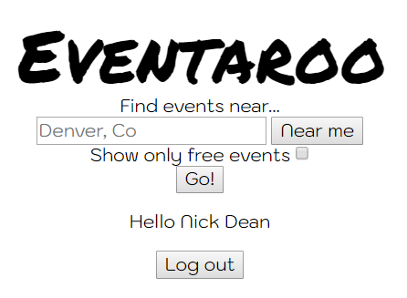
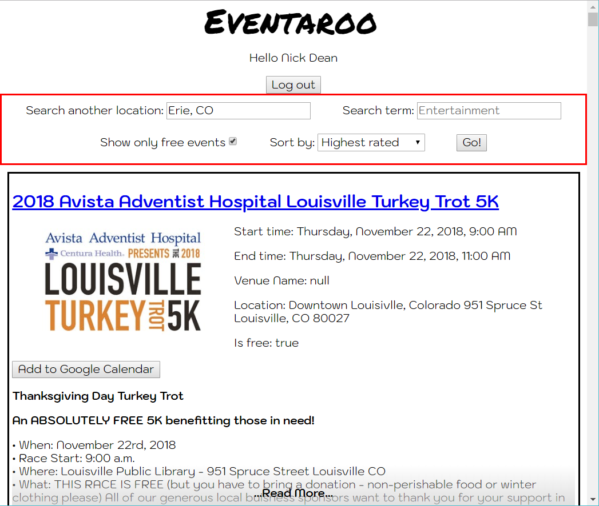
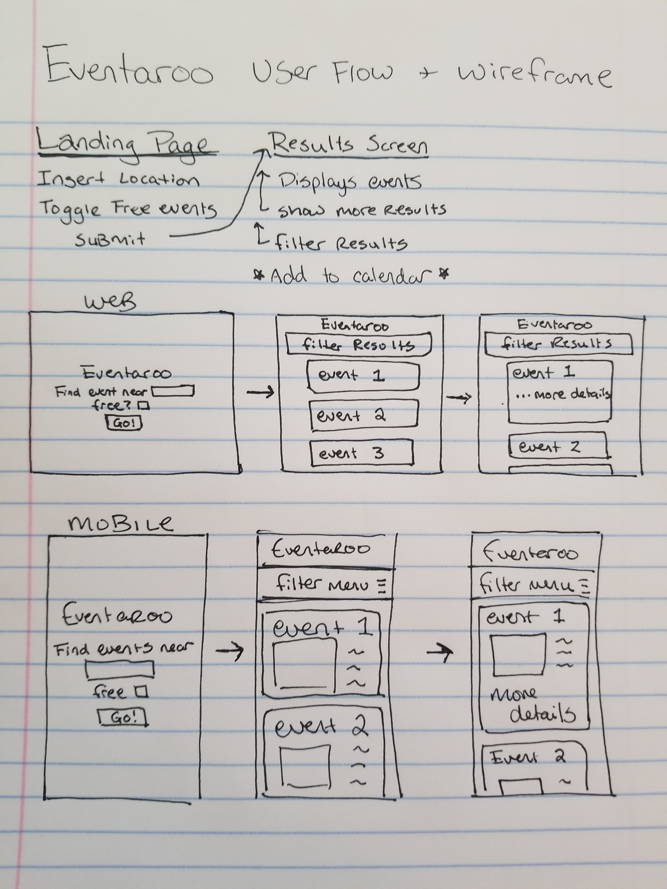

# Eventaroo

Website to help users find events near them, based on price, and giving the ability to add events to their calendar.

## Live site

[Link to Eventaroo's live Github pages site](https://klick5000.github.io/eventaroo/)

[Link to archived MVP version of Eventaroo - hosted on Surge](https://eventaroo-mvp.surge.sh)

[Link to active beta Eventaroo Surge development build](https://eventaroo.surge.sh)

## Version MVP (Minimal Viable Product)

### Image of MVP Title Screen

### Image of MVP Results Screen

### Wireframe image

## With a little bit of CSS

