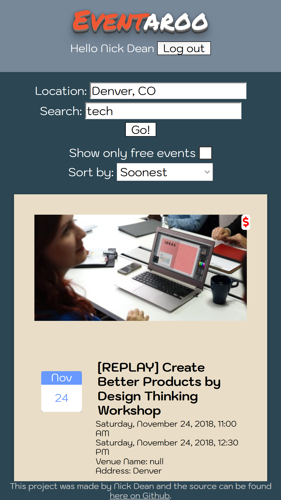
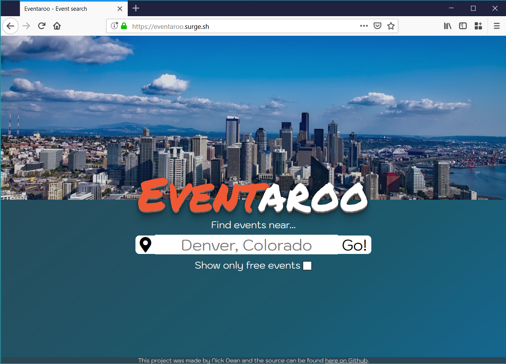
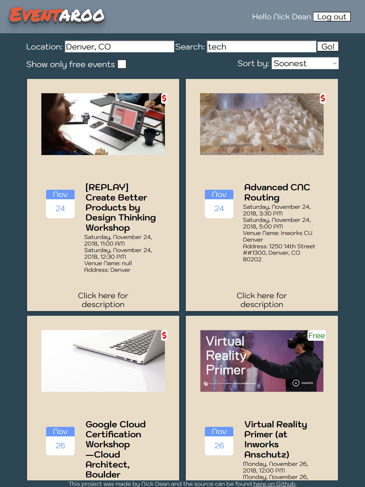
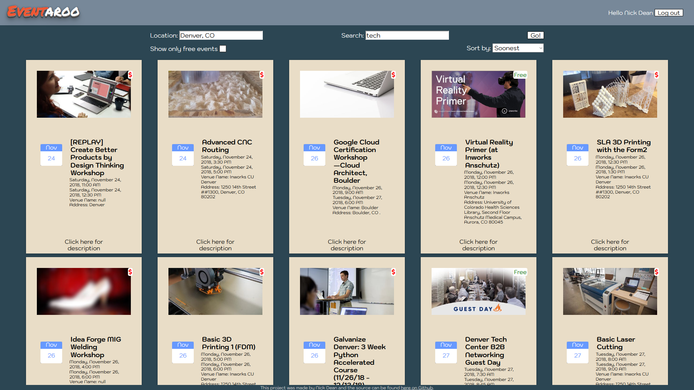

# Eventaroo Summary

Website to help users find events near them, based on price, and giving the ability to add events to their Google calendar.

Short User story:  If a user is looking for something to do, they can input their location, either by typing or clicking on the "find location" icon. They can then toggle wether or not the results display Free events only. The user is then taken to the results screen which shows a list of events withing a certain distance starting from soonest to latest. The user can eiher filter the results more, or click on an event to open the description or add to their google calendar.

## Live site

[Link to Eventaroo's live Github pages site](https://klick5000.github.io/eventaroo/)

[Link to archived MVP version of Eventaroo - hosted on Surge](https://eventaroo-mvp.surge.sh)

[Link to active beta Eventaroo Surge development build](https://eventaroo.surge.sh)

## Technologies used

HTML, CSS, Javascript, Jquery, API calls to Eventbrite/Google-Maps/Google-Calendar

## Version MVP (Minimal Viable Product)

### Image of MVP Title Screen

### Image of MVP Results Screen

### Wireframe image

## With a little bit of CSS

[Color theme](https://coolors.co/0e4d6c-f05833-e9ddc7-ffffff-2c4653)

## Final version

### Mobile

### Desktop/other

## Other features to implement in future versions

[ ] make the filter buttons submit when changed

[ ] add page numbers to Pagination
