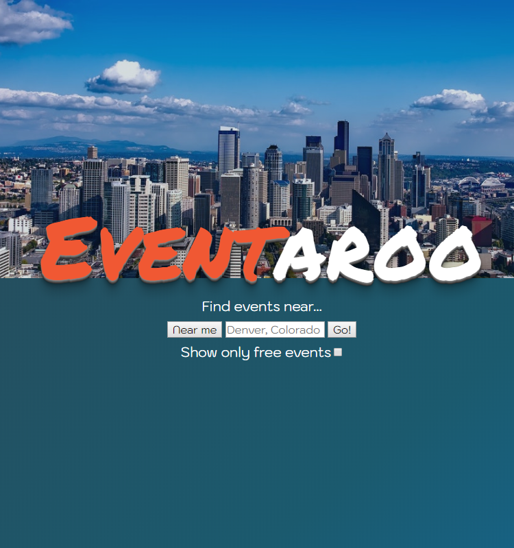

# Eventaroo

Website to help users find events near them, based on price, and giving the ability to add events to their calendar.

## Live site

[Link to Eventaroo's live Github pages site](https://klick5000.github.io/eventaroo/)

[Link to archived MVP version of Eventaroo - hosted on Surge](https://eventaroo-mvp.surge.sh)

[Link to active beta Eventaroo Surge development build](https://eventaroo.surge.sh)

## Version MVP (Minimal Viable Product)

### Image of MVP Title Screen

### Image of MVP Results Screen

### Wireframe image

## With a little bit of CSS

[Color theme](https://coolors.co/0e4d6c-f05833-e9ddc7-ffffff-2c4653)

TODO
[x] Add spacing on either side of the screen on results. 50px on results listing div.

[x] Figure out description how to resize the result containers

[x] Buttons for pagination need to be smaller, arrow icon

[x] seperate search another location and the other terms.

[ ] make the filter buttons submit when changed

[x] Float left the title and float right the Log in with google.

[x] fix pagination spacing on the bottom.

Optional tasks:

[ ] add page numbers to Pagination
